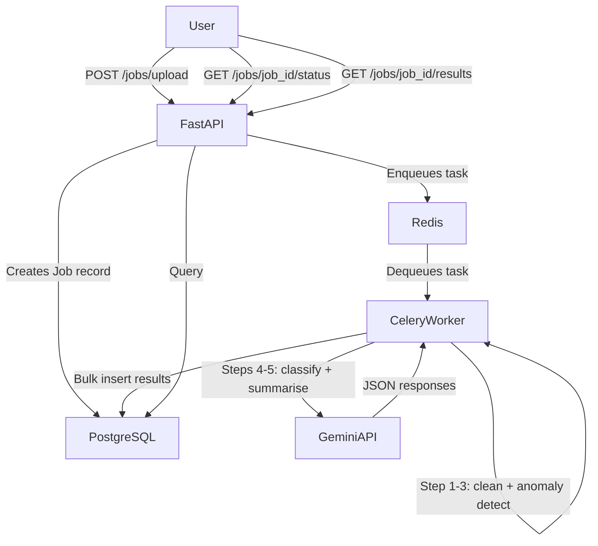

# AI-Powered Transaction Processing Pipeline

A production-grade backend service that accepts dirty CSV financial transaction data, processes it asynchronously, uses Google Gemini to classify transactions and generate narrative summaries, and exposes a polling REST API to retrieve results.

---

## Architecture

```
┌─────────────────────────────────────────────────────────────┐
│                        Client / curl                         │
└──────────────────────────┬──────────────────────────────────┘
                           │ POST /jobs/upload
                           ▼
┌─────────────────────────────────────────────────────────────┐
│                    FastAPI (port 8000)                        │
│  • Validates file    • Creates Job record (status=pending)   │
│  • Saves CSV to disk • Returns job_id immediately            │
└──────────────┬──────────────────────────────────────────────┘
               │ apply_async(job_id)
               ▼
┌─────────────────────────────────────────────────────────────┐
│              Redis (Celery Broker + Result Backend)           │
└──────────────┬──────────────────────────────────────────────┘
               │ dequeue
               ▼
┌─────────────────────────────────────────────────────────────┐
│                    Celery Worker                              │
│  Step 1  Read CSV from disk                                  │
│  Step 2  Clean data (dates, amounts, casing, dedup)          │
│  Step 3  Anomaly detection (2 rules)                         │
│  Step 4  LLM batch category classification (Gemini)          │
│  Step 5  LLM narrative summary (Gemini)                      │
│  Step 6  Retry logic (exponential backoff, 3 attempts)       │
└──────────────┬──────────────────────────────────────────────┘
               │ bulk insert
               ▼
┌─────────────────────────────────────────────────────────────┐
│                   PostgreSQL 16                               │
│  Tables: jobs · transactions · job_summaries                 │
└─────────────────────────────────────────────────────────────┘
```

### Mermaid Diagram



---

## Folder Structure

```
transaction-processing-pipeline/
├── app/
│   ├── api/
│   │   └── routes/
│   │       └── jobs.py          # All four REST endpoints
│   ├── core/
│   │   ├── config.py            # Pydantic-settings configuration
│   │   └── logging.py           # Structured JSON logging
│   ├── db/
│   │   ├── base.py              # SQLAlchemy engine + Base
│   │   └── session.py           # FastAPI DB dependency
│   ├── models/
│   │   ├── job.py               # Job ORM model
│   │   ├── transaction.py       # Transaction ORM model
│   │   └── job_summary.py       # JobSummary ORM model
│   ├── schemas/
│   │   ├── job.py               # Job Pydantic schemas
│   │   └── transaction.py       # Transaction Pydantic schemas
│   ├── services/
│   │   ├── job_service.py       # Job database operations
│   │   ├── transaction_service.py  # Transaction DB operations
│   │   └── llm_service.py       # Gemini API integration
│   ├── workers/
│   │   ├── celery_app.py        # Celery application factory
│   │   └── tasks.py             # process_job Celery task
│   ├── utils/
│   │   ├── csv_cleaner.py       # Data cleaning utilities
│   │   └── anomaly_detector.py  # Anomaly detection rules
│   └── main.py                  # FastAPI app factory
├── alembic/
│   ├── versions/
│   │   └── 001_initial_schema.py
│   ├── env.py
│   └── script.py.mako
├── uploads/                     # CSV files saved here (Docker volume)
├── Dockerfile
├── docker-compose.yml
├── requirements.txt
├── alembic.ini
├── .env.example
└── README.md
```

---

## Setup

### Prerequisites

- Docker ≥ 24.0
- Docker Compose ≥ 2.20
- A free Google Gemini API key (https://aistudio.google.com/app/apikey)

### 1. Clone and configure

```bash
git clone <your-repo-url>
cd transaction-processing-pipeline

# Copy the example env file and fill in your Gemini key
cp .env.example .env
# Edit .env and set GEMINI_API_KEY=your_actual_key
```

### 2. Start the entire stack

```bash
docker compose up --build
```

That single command:
- Builds the Docker image
- Starts PostgreSQL, Redis, the FastAPI API, and the Celery worker
- Runs Alembic migrations automatically before the API starts
- Mounts a shared volume for uploaded CSV files

### 3. Verify the stack is running

```bash
curl http://localhost:8000/health
# {"status":"ok","service":"transaction-api"}
```

Interactive API docs: http://localhost:8000/docs

---

## Environment Variables

| Variable | Default | Description |
|---|---|---|
| `GEMINI_API_KEY` | *(required)* | Google Gemini API key |
| `GEMINI_MODEL` | `gemini-1.5-flash` | Gemini model name |
| `DATABASE_URL` | `postgresql://...@postgres:5432/transactions_db` | Full PostgreSQL DSN |
| `CELERY_BROKER_URL` | `redis://redis:6379/0` | Celery broker |
| `CELERY_RESULT_BACKEND` | `redis://redis:6379/1` | Celery result store |
| `UPLOAD_DIR` | `/app/uploads` | Where CSV files are saved |
| `LLM_MAX_RETRIES` | `3` | Gemini retry attempts |
| `LLM_RETRY_BASE_DELAY` | `2.0` | Backoff base delay (seconds) |
| `APP_DEBUG` | `false` | Enable debug logging |

---

## API Documentation

### POST /jobs/upload

Upload a CSV file for async processing. Returns a `job_id` immediately.

**Request**
```bash
curl -X POST http://localhost:8000/jobs/upload \
  -F "file=@transactions.csv"
```

**Response (202 Accepted)**
```json
{
  "job_id": "3f2a1b4c-...",
  "filename": "transactions.csv",
  "status": "pending",
  "message": "File accepted. Processing has started in the background."
}
```

---

### GET /jobs

List all jobs. Supports `?status=` filter.

```bash
# All jobs
curl http://localhost:8000/jobs

# Only completed jobs
curl "http://localhost:8000/jobs?status=completed"
```

**Response (200 OK)**
```json
[
  {
    "id": "3f2a1b4c-...",
    "filename": "transactions.csv",
    "status": "completed",
    "row_count_raw": 95,
    "row_count_clean": 92,
    "created_at": "2024-12-01T10:00:00Z"
  }
]
```

---

### GET /jobs/{job_id}/status

Poll for job processing status.

```bash
curl http://localhost:8000/jobs/3f2a1b4c-.../status
```

**Response while processing (200 OK)**
```json
{
  "job_id": "3f2a1b4c-...",
  "status": "processing",
  "filename": "transactions.csv",
  "created_at": "2024-12-01T10:00:00Z",
  "completed_at": null,
  "error_message": null,
  "summary": null
}
```

**Response when completed (200 OK)**
```json
{
  "job_id": "3f2a1b4c-...",
  "status": "completed",
  "filename": "transactions.csv",
  "created_at": "2024-12-01T10:00:00Z",
  "completed_at": "2024-12-01T10:01:23Z",
  "error_message": null,
  "summary": {
    "total_spend_inr": 485230.50,
    "total_spend_usd": 15420.00,
    "anomaly_count": 7,
    "risk_level": "high",
    "narrative": "The account shows elevated spending across retail and food categories..."
  }
}
```

---

### GET /jobs/{job_id}/results

Full structured results including all transactions.

```bash
curl http://localhost:8000/jobs/3f2a1b4c-.../results
```

**Response (200 OK)**
```json
{
  "job_id": "3f2a1b4c-...",
  "status": "completed",
  "total_transactions": 92,
  "transactions": [
    {
      "id": 1,
      "job_id": "3f2a1b4c-...",
      "txn_id": "TXN1065",
      "date": "2024-09-04",
      "merchant": "Flipkart",
      "amount": 10882.55,
      "currency": "INR",
      "status": "SUCCESS",
      "category": "Shopping",
      "account_id": "ACC003",
      "notes": "Refund expected",
      "is_anomaly": false,
      "anomaly_reason": null,
      "llm_category": null,
      "llm_raw_response": null,
      "llm_failed": false
    }
  ],
  "anomalies": [
    {
      "id": 12,
      "txn_id": "TXN1021",
      "merchant": "Zomato",
      "amount": 2536.35,
      "currency": "USD",
      "account_id": "ACC001",
      "anomaly_reason": "Currency is USD but merchant 'Zomato' is a domestic-only Indian brand"
    }
  ],
  "category_breakdown": {
    "Shopping": 145230.50,
    "Food": 32100.00,
    "Travel": 18200.75
  },
  "summary": {
    "total_spend_inr": 485230.50,
    "total_spend_usd": 15420.00,
    "top_merchants": [
      {"merchant": "Amazon", "total": 95000.00},
      {"merchant": "Flipkart", "total": 74000.00},
      {"merchant": "HDFC ATM", "total": 52000.00}
    ],
    "category_breakdown": {"Shopping": 145230.50, "Food": 32100.00},
    "anomaly_count": 7,
    "narrative": "The dataset reveals heavy retail spending concentrated on Amazon and Flipkart...",
    "risk_level": "high"
  }
}
```

---

## Processing Pipeline Details

### Data Cleaning (Step 2)

| Issue | Fix |
|---|---|
| Mixed date formats (`DD-MM-YYYY`, `YYYY/MM/DD`) | Normalised to ISO 8601 (`YYYY-MM-DD`) |
| Dollar prefix on amounts (`$11325.79`) | Stripped, cast to float |
| Inconsistent currency casing (`inr`, `INR`) | Uppercased |
| Inconsistent status casing (`success`, `SUCCESS`) | Uppercased |
| Missing category | Filled with `"Uncategorised"` |
| Exact duplicate rows | Removed |

### Anomaly Detection (Step 3)

**Rule 1 – Statistical outlier:** Amount > 3× the median for the same `account_id`.

**Rule 2 – Currency/merchant mismatch:** `currency == USD` AND merchant is one of `Swiggy`, `Ola`, or `IRCTC`.

### LLM Processing (Steps 4–5)

- All uncategorised transactions are batched into **one** Gemini request.
- A **single** separate request generates the narrative summary.
- Both calls use exponential backoff with 3 retry attempts.
- If retries fail, `llm_failed = true` is set on affected rows and processing continues.

---

## Docker Commands

```bash
# Start everything (first run builds the image)
docker compose up --build

# Start in detached mode
docker compose up --build -d

# View logs
docker compose logs -f api
docker compose logs -f worker

# Stop everything
docker compose down

# Stop and remove volumes (wipes the database)
docker compose down -v

# Rebuild after code changes
docker compose up --build --force-recreate
```

---

## Troubleshooting

**`GEMINI_API_KEY` not set / API returns 500 on summary generation**
→ Ensure your `.env` file has `GEMINI_API_KEY=your_real_key`. Restart with `docker compose up --build`.

**Job stays in `processing` forever**
→ Check the Celery worker logs: `docker compose logs -f worker`. The worker must be healthy before it picks up tasks.

**`relation "jobs" does not exist`**
→ Alembic migrations did not run. Check API container logs: `docker compose logs api`. The migration runs in the API startup command.

**Port 8000 already in use**
→ Change the host port in `docker-compose.yml`: `"8001:8000"`.

**Workers not picking up tasks after Redis restart**
→ Restart the worker: `docker compose restart worker`.

---

## Future Improvements

1. **Async SQLAlchemy** — Replace the sync ORM with `asyncpg` + SQLAlchemy async sessions for true non-blocking DB I/O inside FastAPI.
2. **Celery Beat** — Add scheduled cleanup tasks to purge old job files.
3. **Flower** — Add the Flower Celery monitoring UI as a compose service.
4. **Authentication** — JWT-based auth to scope jobs per user.
5. **Webhook callbacks** — Notify a client URL when job processing completes.
6. **Horizontal scaling** — Increase Celery worker concurrency or add multiple worker replicas; add a connection pooler (PgBouncer) in front of PostgreSQL.
7. **Object storage** — Replace local file storage with S3/GCS for uploaded CSVs.
8. **Rate limiting** — Add FastAPI rate limiting middleware on the upload endpoint.
